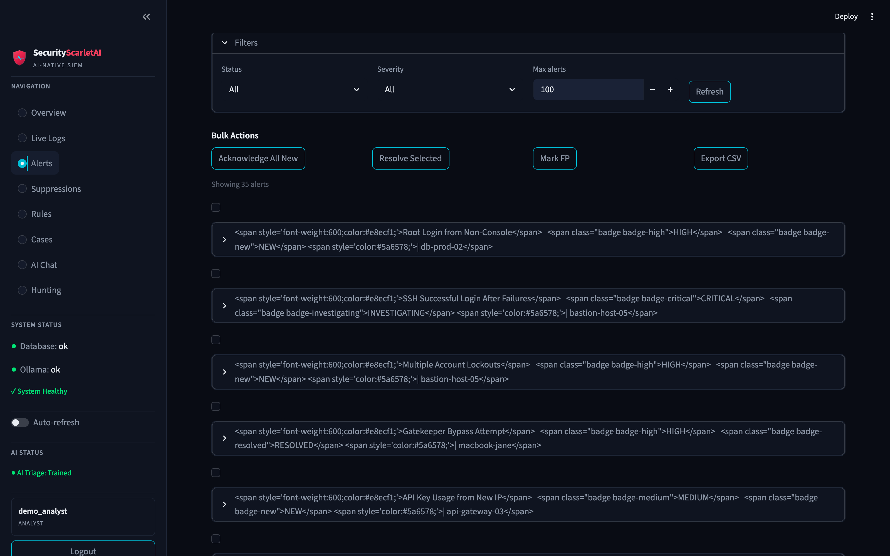
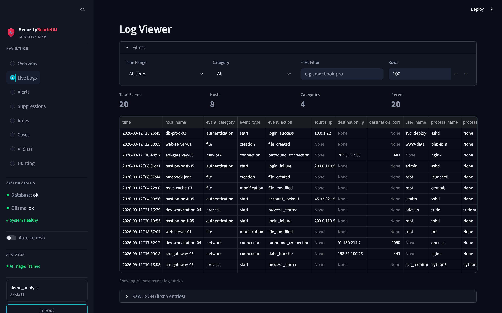
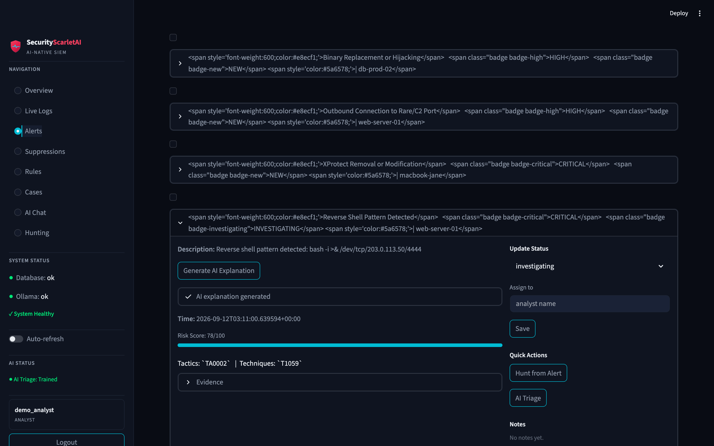
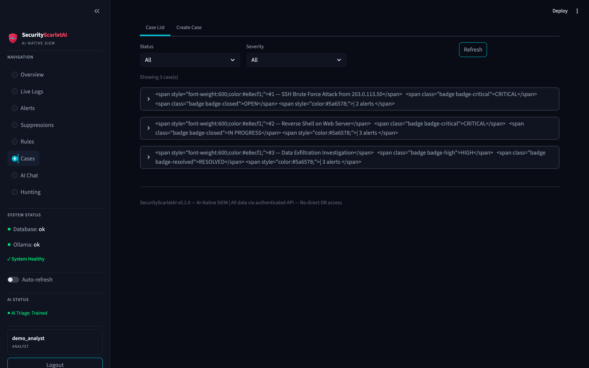
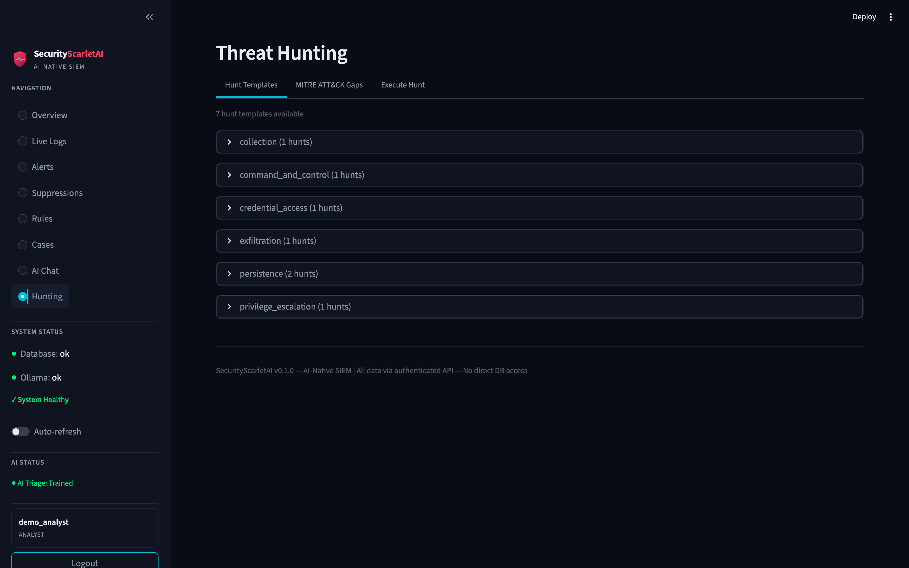
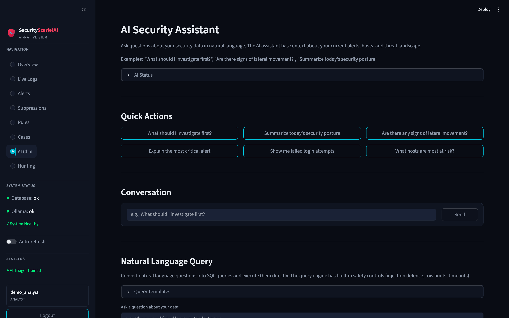
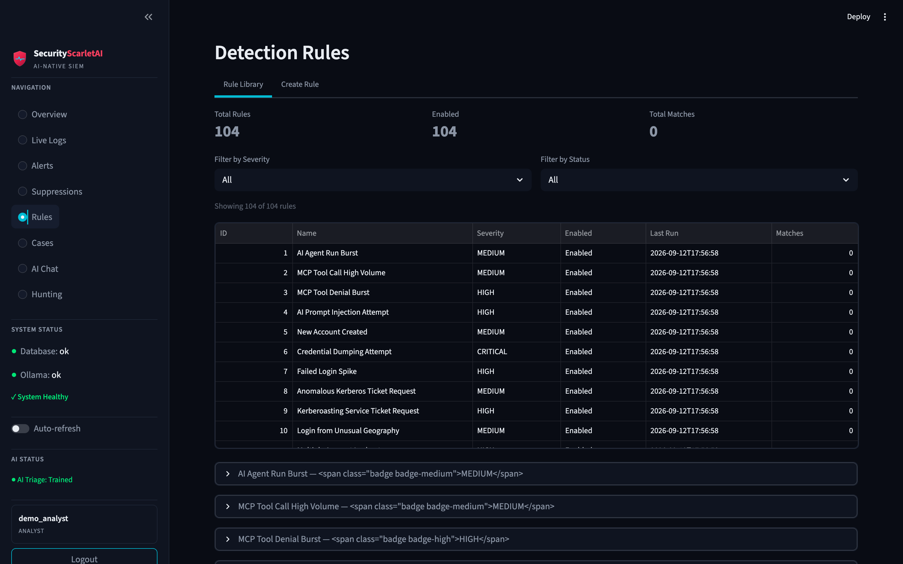
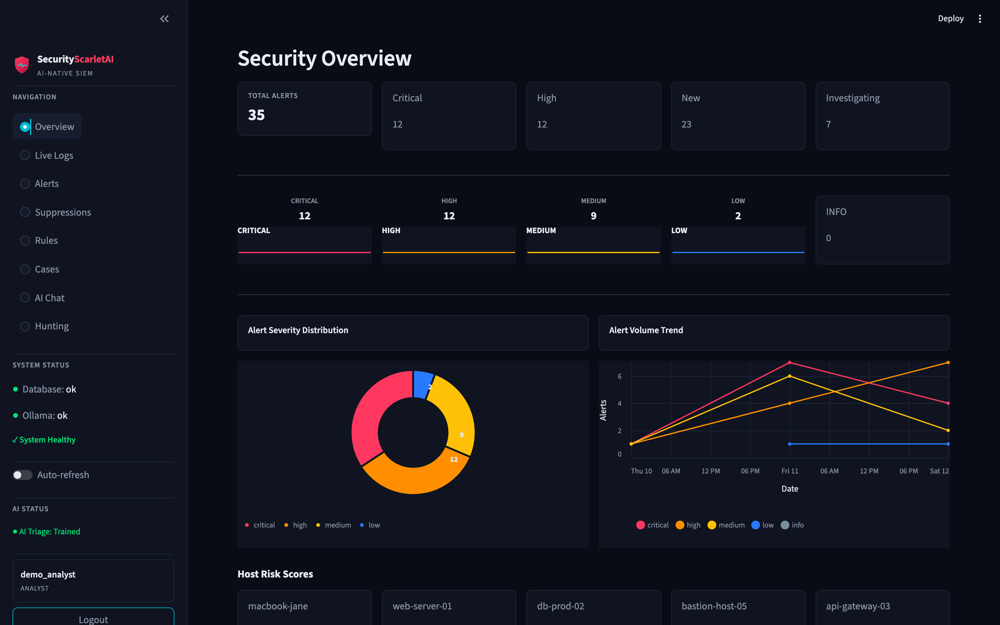

# SecurityScarletAI

**The AI-native SIEM that proves its own detections work.**

[](https://github.com/aiagentmackenzie-lang/securityscarletai/actions/workflows/ci.yml)
[](LICENSE)
[](pyproject.toml)
[](https://fastapi.tiangolo.com)
[](https://www.postgresql.org)
[](https://redis.io)
[](https://www.timescale.com)
[](https://streamlit.io)
[-111111)](https://ollama.com)
[](docs/RULES.md)
[](https://attack.mitre.org)

SecurityScarletAI is an open-source, self-hosted SIEM for macOS, Linux, and
Windows hosts and small fleets: real osquery telemetry in, Sigma detections +
LLM-driven investigation out — with every AI decision recorded and every response action
**verified by re-querying the system it changed**. The LLM runs locally via
Ollama. No cloud, no phone-home; the whole stack is air-gappable.

Most security dashboards show you charts. This one shows you **receipts**:

- **Verified detections, not vibes.** A built-in purple-team loop fires the
  full correlation matrix through the real pipeline — shipper → parser →
  Postgres → Sigma → correlation — and scores every run. The latest committed
  run: **10/10 chains fired (score 1.0), 43 alerts, 16 MITRE ATT&CK
  techniques hit**, with the full run history and a machine-readable
  fix-feedback artifact committed under [`runs/`](runs/). Runs are also
  self-scored against the published MITRE ATT&CK Evaluations Enterprise 2026
  TES methodology (ACW-weighted coverage, detection precision with the
  case-consolidation penalty, detection speed, IQI-style investigation
  coverage) — labeled self-scored, never program participation.
- **Governed AI.** The investigation agent is read-only and its verdicts are
  always drafts until a human confirms them. Response actions run through a
  fail-closed policy engine (`allow` / `approval_required` / `never`), a
  four-eyes approval gate (the requester cannot self-approve), and a
  post-execution re-query that records before/after state — or reports the
  action honestly as unverified. One read-only endpoint (`GET /decisions`)
  assembles the entire decision trail — the artifact a governed-autonomy
  buyer (EU AI Act Art. 14, NIST AI RMF GOVERN) asks for.
- **Sovereign by default.** Local Ollama, loopback-only publishing,
  DB-enforced append-only audit trail, verified backups with restore tests,
  and a documented air-gapped deployment. Your telemetry never leaves the box.
- **Scale built in.** Logs live in a TimescaleDB hypertable (compression +
  policy-driven retention), and hosts enroll into a fleet with
  sha256-at-rest tokens, host-bound identity (a stolen token cannot spoof
  another host), and a fail-closed agent install kit.

| | Verified state (2026-09-18 — counts hand-checked against the code after the 11-wave quality audit, no auto-updating badge) |
|---|---|
| Release | **v0.8.0** (2026-09-17) — first receipted release: SBOM + attestation bundles on the release page, cosign-verified image in GHCR (public), buyer commands in SECURITY.md |
|---|---|
| Tests | **2,483 unit** (mocked DB) + **40 integration** against live Postgres, CI-enforced coverage ≥ 80%, measured **87%** |
| Detections | **116 Sigma rules** (vocabulary-gated in CI; 118 pre-audit — the 2026-09-18 audit wave merged/deleted two identical-detection rules) · **10 correlation chains** — all 10 live-fire verified through the real pipeline (purple-loop score 1.0, 2026-09-14) |
| Agentic | Read-only investigator · SIEM **MCP server** (3 tools over a scoped read-only DB role) · AI-usage detection domain |
| Response | 6 action types — 3 live-verified on the reference deployment, 3 capability-gated fail-closed |
| Pipeline | Real osqueryd telemetry → Sigma alerts in production since 2026-09-04 · FIM file telemetry · fleet ingest (macOS/Linux/Windows agents; Windows auth via Security eventid 4624/4625) · TimescaleDB store |

---

## Architecture

```
 osqueryd / fleet agents ──▶ FileShipper / raw-line ingest ──▶ ECS Parser ──▶ LogWriter
        NeuralGuard (AI firewall verdicts) ──────────────────────────┘                  │
                                                                                        ▼
                                                              Postgres/TimescaleDB ◀── Enrichment
                                                                        │               (GeoIP · DNS · TI)
                                                                        ▼
                                     Sigma scheduler + correlation sweep ──▶ Alerts
                                                                        │
                                              ┌─────────────────────────┼─────────────────────────┐
                                              ▼                         ▼                         ▼
                                        ML triage + UEBA        LLM explain/chat/NL→SQL      Cases + response
                                              └────────────────────────┬─────────────────────────┘
                                                                       ▼
                                                    Dashboard (Streamlit) · MCP server · /decisions
```

| Layer | Technology | What it does |
|---|---|---|
| Ingestion | FastAPI + asyncpg | Bearer-token HTTP ingest (≤1,000 events/batch, rate-limited), checkpointed osquery file shipper, raw-line fleet endpoint with server-side parsing, fire-and-forget enrichment |
| Storage | TimescaleDB (PostgreSQL 17) + Redis 7 | Hypertable with 1-day chunks, compression + 30-day retention; Redis for rate-limit state and the JWT blocklist |
| Detection | Sigma → parameterized SQL + correlation engine | 118 rules across 9 categories; 10 event-driven correlation chains with `as_of` time binding and persisted matches |
| Enrichment | GeoIP2 + DNS + threat intel | MaxMind GeoIP, PTR lookup, AbuseIPDB/OTX/URLhaus IOC match with severity boost |
| AI/ML | Ollama (mistral:7b) + scikit-learn | Calibrated Random-Forest triage, Isolation-Forest UEBA, NL→SQL with 7-layer injection defense, LLM explanations with template fallback, per-call cost tracking |
| Response | Policy engine + executors | Notification channels (Slack / HMAC-signed webhook / PagerDuty / email, per-severity routing + retry + audited), SIEM-user disable, host quarantine (+3 capability-gated); every outcome re-queried and recorded |
| Dashboard | Streamlit + WebSocket | Real-time alerts, cases, hunting, AI chat; JWT or service-bearer auth |
| Audit | DB-enforced middleware | Every state-changing request → `audit_logs`; two-role deploy makes UPDATE/DELETE/TRUNCATE impossible for the app role |

## Features

**Detection & telemetry**
- 116 Sigma rules — authentication, process, network, file, macOS, cloud, AI,
  AI-usage, deception, and identity categories, MITRE ATT&CK-mapped
  ([docs/RULES.md](docs/RULES.md); 118 before the 2026-09-18 audit wave removed
  two identical-detection rules)
- 10 event-driven correlation chains: brute force → success, payload → C2,
  persistence activation, data exfiltration, privilege escalation, credential
  theft + exfil, defense evasion, sustained AI-firewall blocks, ClickFix drop →
  interpreter execution, AI CLI → external egress — all 10 live-fire verified
  through the real pipeline (2026-09-14 purple-loop pass, score 1.0)
- Evidence-driven coverage map (`GET /detection/coverage`): which rules are
  **armed** by real telemetry vs **dormant** (with itemized reasons) — 102/123
  armed on the reference deployment (measured 2026-09-14 purple-loop pass;
  113 Sigma rules + 10 correlation chains at measurement; 116 after W1.5's
  deception rules; 118 with the identity rules; 116 after the 2026-09-18
  audit wave merged two identical-detection pairs — deception reports
  DORMANT-BY-SOURCE until its shipper is enabled)
- Rule backtesting (`POST /detection/backtest`): "would this rule have fired
  in the last N days, on how many rows, at what false-positive cost?" — any
  draft or enabled rule compiles through the production Sigma→SQL compiler
  and replays read-only against the stored logs window (bounded ≤30d,
  index-aware, per-query timeout). Returns hit count, per-day distribution,
  top offending field values, an estimated alert volume (replaying the real
  15-min alert-dedup semantics), and a projected FP ratio where prior
  adjudicated alerts exist. Honesty gates: fail-safe compilations and empty
  corpora report **unmeasured** (never a fake 0); never persists, never
  auto-arms; audited (analyst+)
- Rule lifecycle scorecard (`GET /detection/scorecard`): per-rule fire
  counts, disposition mix, FP ratio, and retirement ADVICE (HITL — never
  automatic)
- ATT&CK Navigator layer export (`GET /detection/coverage/navigator`): the
  analyst-standard coverage artifact in the official layer-file format
  (v4.5) — per-technique armed-coverage scores (0–100, red→green gradient)
- Deception ingestion (W1.5): HONEYTRAP honeypots and the fleet canary
  playbook emit a closed deception-vocabulary event stream
  (`src/ingestion/deception.py`, NDJSON shipper or host-bound /ingest);
  3 dedicated Sigma rules — canary access/token use are **critical by
  construction** (severity floor, downgrade refused) and auto-create a
case in create_alert; probes alert + notify. Near-zero-FP doctrine:
  nothing in production traffic should ever touch a honeypot
  ([docs/RULES.md](docs/RULES.md) → Deception)
- SSF/CAEP identity signals (W1.4): an RFC 8935 push receiver ingests
  Shared Signals Framework Security Event Tokens from configured IdP
  transmitters (session-revoked, credential-change, the SSF verification
  health-check) — authentication is the SET signature itself against the
  transmitter's JWKS, every claim fail-closed (explicit secevent+jwt
  typing, no sub/exp, top-level sub_id, closed event vocabulary,
  kid-pinned ES256/RS256); 2 high-severity identity rules; verified
  containment (e.g. disable_siem_user) propagates back OUT as a signed CAEP
  session-revoked SET to configured receivers — the SIEM speaks the
  identity-signal protocol in both directions ([docs/RULES.md](docs/RULES.md)
  → Identity, [docs/PRODUCTION.md](docs/PRODUCTION.md) §10)
- SigmaHQ community import pipeline (W2.1): a local SigmaHQ rules checkout
  is classified into an honest import report — imported / needs-rewrite /
  unsupported, with reasons per rule, **no silent drops**; imported rules
  are dialect-translated (logsource category + CamelCase field maps),
  verified through the PRODUCTION compiler with zero fail-safe warnings,
  tagged `source.sigmahq`, and staged **born `enabled: false` OUTSIDE the
  live rules tree** — promoting + arming stays an explicit operator
  decision ([docs/PRODUCTION.md](docs/PRODUCTION.md) §11); the boot
  reconciler honors an `enabled:` frontmatter extension (shipped rules
  unaffected)
- Durable ingest buffer (W2.2): a Redis-Streams buffer between the API
  ingest path and the batched writer — consumer group, **ACK only after
  DB persist**, crash-safe (orphans reclaimed via XAUTOCLAIM), bounded
  backlog (MAXLEN), poison entries preserved to a dead-letter stream;
  removes the documented at-most-once in-process writer-buffer loss.
  OFF by default; when enabled, Redis unavailable → the ingest endpoints
  refuse with **503 (fail-closed)** — the SIEM never accepts at-most-once
  while promising durability. Delivery becomes at-least-once (duplicates
  possible on persist-retry — labeled, never silent)
  ([docs/PRODUCTION.md](docs/PRODUCTION.md) §12)
  with disposition-weighted FP ratios in the comments; one-click download
  from the dashboard, importable at attack.mitre.org
- EndpointSecurity process telemetry (`exec`/`exit`, codesigning evidence) and
  FIM file events (LaunchAgents/LaunchDaemons, `.ssh`, `/tmp`, `/var/log`,
  sha256-hashed) via a root LaunchDaemon
- Fleet ingest: per-host enrollment, host-bound tokens with whole-batch spoof
  refusal (403 + audited), immediate revocation, dumb shippers + server-side
  parsing, a stdlib-only `fleet_shipper.py`, and a fail-closed
  [deployment kit](deploy/fleet/) (Linux systemd + macOS launchd + Windows
  scheduled task) — a mixed-estate fleet with identity telemetry on all
  three platforms

**AI & ML**
- ML alert triage: calibrated Random Forest with cross-validated accuracy and
  full training provenance persisted; auto-retrains hourly once ≥100 resolved
  alerts exist
- NL→SQL hunting in plain English behind 7 layers of defense: input
  sanitization, read-only system prompt (SELECT/WITH output; DML forbidden),
  sqlparse structural validation, forbidden-pattern check, EXPLAIN cost gate
  (10K rows), 1,000-row result cap, 5-second timeout
- UEBA behavioral baselines (Isolation Forest) with per-user fingerprints
- LLM alert explanation + AI chat with a structured `LLMResult` contract,
  versioned prompts, per-call cost tracking, and untrusted-log data-fencing
  (OWASP LLM01) + per-user quotas (LLM10)
- Threat hunting: 7 pre-built hunt templates, MITRE ATT&CK gap analysis,
  hunt-from-alert suggestions

**The trusted loop — cases, response, decisions**
- Durable case object: append-only `case_events` timeline with a closed event
  vocabulary; verdicts require written rationale; nobody resolves or closes an
  unadjudicated case
- Bounded response authority: `config/response_policy.yaml` decides
  `allow` / `approval_required` / `never` per action type, fail-closed on
  anything unknown; approvals are four-eyes (requester ≠ approver) and carry
  rollback notes
- Verified outcomes: the executor re-queries the source system after every
  action. On this deployment: `disable_siem_user` (login-refusal proof),
  `quarantine_host` (ingest endpoint refuses that host's telemetry),
  `notify_slack` (webhook receipt) — live-verified; `pf_block_ip`,
  `disable_macos_user`, `isolate_host_fleet` — capability-gated fail-closed
- Notification channels (Wave 1): versioned, fail-closed
  `config/notification_channels.yaml` routes alerts to Slack / generic
  webhook (HMAC-signed, receiver contract in PRODUCTION.md §8) / PagerDuty /
  email with per-severity routing, bounded retry + backoff, and every
  dispatch outcome audited; legacy single-webhook deployments keep their
  behavior unchanged
- Governed decision records: AI triage, correlation matches, human verdicts,
  response actions with approval + verification trails, and policy refusals in
  one read-only surface (`GET /decisions`)

**Agentic SOC**
- Read-only investigation agent: plan → query → correlate → verdict **DRAFT**;
  every query rides the full NL→SQL guardrail stack, every step rides the
  append-only audit chain, and only a human confirms the verdict (mandatory
  note)
- Agentic memory (Wave 1): few-shot exemplars from past adjudicated alerts
  of the same rule shape (bounded, PII-conscious) into the verdict prompt;
  dead-end tracking (each plan hypothesis reported as supported / ruled out
  / unresolved with the evidence that decided it); and an outcome linkage
  (`GET /agent/runs/{id}/outcome`) that makes draft-vs-human agreement
  measurable over time — retrieval is read-only, HITL unchanged
- SIEM as an MCP server: JSON-RPC 2.0 (SSE refused, fail-closed) exposing
  exactly three read-only tools — `investigate`, `hunt`, `explain` — running
  as a scoped read-only DB role verified against `information_schema` at boot
- AI usage as a detection domain: agent runs, MCP tool calls/denials, and
  prompt-injection events are first-class telemetry with 4 Sigma rules
  ([docs/AI_USAGE_DETECTIONS.md](docs/AI_USAGE_DETECTIONS.md)) — the SIEM
  watches its own agents

**Platform & operations**
- Purple-loop validation (`python -m scripts.purple_loop`): live-fire the
  correlation matrix, score coverage, emit machine-readable feedback, and
  track run-to-run progression from committed evidence; every run is also
  self-scored against the published ATT&CK Evaluations Enterprise 2026 TES
  methodology (versioned ACW weights in `config/purple_tes.yaml`, snapshot
  stored with each run; unmeasurable components report "unmeasured" — never
  a fabricated 0)
- TimescaleDB telemetry store: 1-day chunks, compression (segmentby host),
  30-day retention — schema block is a guarded no-op on vanilla PostgreSQL
- Hardened local-production overlay: loopback-only publishing, authenticated
  Redis, enforced `PASSWORD_PEPPER`, no-new-privilege containers, two-role
  DB with DB-enforced audit immutability re-applied every boot, verify-gated
  nightly backups + restore test, edge-triggered health watchdog
- Admin user management, Prometheus `/metrics`, DB-backed audit query,
  dead-letter queue replay, bounded-storage retention

## Quickstart

```bash
git clone https://github.com/aiagentmackenzie-lang/securityscarletai.git
cd securityscarletai
cp .env.example .env        # generate real secrets — the app fail-fasts on placeholders
```

One stack, three run modes — pick the mode first; it decides what goes in
`.env` and what the first boot does:

| | **Demo** | **Local production** | **Dev** |
|---|---|---|---|
| For | showing the product | a real SIEM on this machine | working on the code |
| Data | synthetic attack story (`DEMO_SEED_ENABLED=true`) | real osqueryd telemetry | whatever the DB has |
| Admin | `demo_analyst` only | bootstrapped admin (random password, one-time file) | your own |
| Guide | [docs/DEMO.md](docs/DEMO.md) | [docs/PRODUCTION.md](docs/PRODUCTION.md) | [docs/DEPLOYMENT.md](docs/DEPLOYMENT.md) |

Demo mode, end to end:

```bash
echo 'DEMO_SEED_ENABLED=true' >> .env    # before the FIRST boot (seeding is opt-in)
make up                                  # Postgres + Redis + API + MCP + dashboard
curl -s http://localhost:8000/api/v1/health   # {"status":"healthy",...}
make demo-refresh                        # slide synthetic data to now (do this before every demo)
open http://localhost:8501               # log in: demo_analyst / demo_analyst_2026
```

The demo seeds a believable attack story — brute force, reverse shell,
exfiltration, insider privilege escalation — across alerts, cases, threat-intel
hits, and AI usage, so every page has something real to look at. **What the
demo contains, how the freshness slider works, page-by-page verification, and
the live-telemetry demo that streams a real reverse-shell pattern through the
detection pipeline: all in [docs/DEMO.md](docs/DEMO.md).**

Production posture (real telemetry, loopback-only, audit-hardened) is one
command with the overlay: `docker compose -f docker-compose.yml -f
docker-compose.local-prod.yml up -d` — see
[docs/PRODUCTION.md](docs/PRODUCTION.md) for the full wiring and its gotchas.

Dev mode (API outside Docker): `poetry install` → apply
`src/db/schema.sql` → `poetry run uvicorn src.api.main:app --port 8000` →
`poetry run streamlit run dashboard/main.py`. Health lives at
[`/api/v1/health`](http://localhost:8000/api/v1/health) (there is no root
`/health`).

## Telemetry sources

- **osquery (host telemetry)** — the API tails osquery's results log through
  the checkpointed FileShipper and normalizes it to ECS via a closed
  vocabulary (`OSQUERY_ECS_MAP`); unmapped event types fail-closed and are
  preserved raw. Fleet hosts POST raw lines to `POST /ingest/osquery` —
  parsing stays server-side, one mapping truth.
- **Identity/auth telemetry (auth shipper)** — `scripts/auth_log_shipper.py`
  tails sshd events from the platform log (macOS unified log; Linux
  `journalctl` with `/var/log/auth.log` fallback) and ships normalized
  `auth_success` / `auth_failed` rows — the brute-force → success chain
  runs on this source. On Windows, auth arrives via the osquery
  `windows_events` table (Security eventid 4624/4625) — no separate shipper.
- **NeuralGuard (AI-firewall verdicts)** — the sibling
  [4-layer AI firewall](https://github.com/aiagentmackenzie-lang/NeuralGuard-AI-Firewall)
  streams every audit verdict (block/allow/quarantine/…) into this SIEM with
  its SHA-256 chain hash + Ed25519 signature intact, so AI-firewall
  detections land in the same pipeline — Sigma rules, correlation, NL→SQL
  included. Verified end-to-end 2026-09-05.

## The API

**108 endpoints** under `/api/v1` (Swagger UI / ReDoc at `/api/docs` and
`/api/redoc` when `DOCS_ENABLED=true` — the dev default; production overlays
serve a 404 there by design).

| Area | Highlights |
|---|---|
| Ingest | `POST /ingest` (≤1,000 events/batch, 100 req/min/IP) · `POST /ingest/osquery` (raw lines) · `POST /ingest/ssf` (RFC 8935 SET push, signature-authenticated) · fleet `enroll` / `hosts` / `revoke` |
| Detection | `GET /rules` (116) · `GET /correlation/rules` · `POST /correlation/run` · `GET /correlation/matches` · `GET /detection/coverage` · `GET /detection/scorecard` · `POST /detection/backtest` (read-only replay) · `GET /detection/coverage/navigator` (ATT&CK layer export) |
| Compliance | `GET /compliance/incidents/{id}/evidence-pack` (UK CS&R 24/72h) · `GET /compliance/reports/coverage` · `GET /compliance/reports/posture` · `GET /compliance/frameworks` · `GET /compliance/retention-policy` |
| AI | `GET /ai/status` · `POST /ai/train` · `POST /ai/triage/{id}` · `POST /ai/explain/{id}` · `GET /ai/ueba/{user}` · `POST /query` (NL→SQL) · `POST /ai/chat` |
| Agentic | `POST /agent/investigate` · `GET /agent/runs/{id}` · `POST /agent/runs/{id}/hitl` |
| Cases & response | `/cases` CRUD · `POST /cases/{id}/verdict` · `GET /cases/{id}/timeline` · `/response/actions` + `approve`/`reject`/`execute` · `GET /decisions` |
| Hunting & intel | `GET /hunt/templates` · `GET /hunt/gaps` · `POST /hunt/from-alert/{id}` · `/threat-intel/stats` · `refresh` · `lookup/ip/{ip}` |
| Ops & auth | `GET /health` · `GET /metrics` (Prometheus) · `/auth/*` (login, change-password) · `/users` (admin) · `GET /audit/requests` · WebSocket live alert feed |

## Security posture

- **Auth** — JWT with per-token `jti`, refresh rotation, Redis-backed logout
  blocklist, password-change invalidation, bcrypt + enforced pepper, three
  roles (admin/analyst/viewer), account lockout, rate limiting
  (`/auth/login` 5/min/IP, `/ingest` 100/min/IP) with fail-open fallback
- **Audit** — every state-changing request → `audit_logs`; the two-role deploy
  revokes UPDATE/DELETE/TRUNCATE at the DB level and re-applies it every boot
  (tamper attempts verified denied)
- **SQL safety** — parameterized queries everywhere; no `NOW()` in
  correlation time predicates (`as_of` binding); 7-layer NL→SQL defense
- **Dashboard hygiene** — all API-origin values treated as untrusted and
  escaped (host names are attacker-writable via `/ingest`); regression-tested
- **Supply chain** — pip-audit on the locked dependency set (2 documented
  risk-accepts, expiring 2026-12-01) + Trivy image scan (HIGH/CRITICAL
  zero-findings enforced in CI)
- **Ops** — verify-gated nightly backups with restore tests, edge-triggered
  health watchdog, bounded-storage retention, air-gapped operation documented
  ([docs/AIR-GAPPED.md](docs/AIR-GAPPED.md))

## Documentation

| Doc | What's inside |
|---|---|
| [docs/DEMO.md](docs/DEMO.md) | The full demo guide: what the demo contains, setup, freshness slider, page-by-page verification, live-telemetry demo, teardown, troubleshooting |
| [docs/PRODUCTION.md](docs/PRODUCTION.md) | Local-production reference: osquery deployment (user agent → root daemon), FIM, hardening, backups, watchdog, runbooks |
| [docs/DEPLOYMENT.md](docs/DEPLOYMENT.md) | Internet-exposed deployment: Caddy + TLS, env vars, hardening checklist, backup & recovery |
| [docs/RULES.md](docs/RULES.md) | All 116 Sigma + 10 correlation rules by category with ATT&CK mappings |
| [docs/COMPLIANCE.md](docs/COMPLIANCE.md) | Compliance runbook: UK CS&R 24/72h evidence packs, standing reports, framework mappings, retention-as-evidence |
| [docs/MODEL_BENCHMARK.md](docs/MODEL_BENCHMARK.md) | LLM model benchmark: candidates, scoring, the measured decision to retain mistral:7b |
| [docs/AI.md](docs/AI.md) | AI internals: LLMResult contract, prompts, cost tracking, triage, UEBA, NL→SQL |
| [docs/AI_USAGE_DETECTIONS.md](docs/AI_USAGE_DETECTIONS.md) | The AI-usage detection domain + OWASP Agentic mappings |
| [docs/ATTACK-SCENARIOS.md](docs/ATTACK-SCENARIOS.md) | 4 attack walkthroughs: SSH brute force, reverse shell, exfiltration, insider privilege escalation |
| [docs/AIR-GAPPED.md](docs/AIR-GAPPED.md) | Sovereign / regulated / no-egress operation |
| [docs/CHANGELOG.md](docs/CHANGELOG.md) | Version history with verification notes |
| [docs/TESTING-ROADMAP.md](docs/TESTING-ROADMAP.md) · [docs/EVOLUTION_ROADMAP_2026-09.md](docs/EVOLUTION_ROADMAP_2026-09.md) | Quality + product roadmaps |

## Status — what "verified" means here

Claims in this README are tied to evidence, and counts are hand-verified
against the code (no auto-updating badge):

- **CI (every push to `main`):** Docker build + real-entrypoint boot gate ·
  ruff + format check + mypy · schema applied with `ON_ERROR_STOP=1` · unit
  suite with the coverage gate · integration suite on a live Postgres ·
  pip-audit · Trivy image scan (HIGH/CRITICAL zero-findings enforced since
  2026-09-10).
- **Unit + integration:** 2,483 unit tests (mocked DB) and 40 integration
  tests (live Postgres) — CI-green on every push (2026-09-18); coverage
  measured **87%** (9,873 statements, 2026-09-18).
- **Live-fire:** the full 10-chain correlation matrix scored 10/10 through
  the real pipeline (2026-09-14: 43 alerts, 25 distinct rules, 16 ATT&CK
  techniques); purple-loop runs committed under [`runs/`](runs/) with the
  full iteration history (7/8 → 8/8 → 10/10) preserved; NeuralGuard ingest
  verified end-to-end (2026-09-05); fleet enrollment + raw-line ingest +
  TimescaleDB migration (zero data loss) + Linux agent live-fire verified
  2026-09-12/13.
- **Standing deployment:** the reference deployment has run as a real
  local-production SIEM (real osqueryd telemetry, hardened overlay) since
  2026-09-04.

## Honest limitations

- **Single uvicorn worker** — the WebSocket registry is in-memory; multi-
  worker requires moving it to Redis first (documented boundary; don't just
  raise `--workers`).
- **Audit immutability is convention-only in the bare default deploy** —
  DB-enforced (REVOKE-based) requires the shipped two-role overlay, which is
  the reference posture.
- **JWT library** is `python-jose 3.5.0` (clears known CVEs; unmaintained
  upstream) — PyJWT migration tracked in the backlog.
- **Dashboard sessions re-login after ~15 min** (short access-token TTL by
  design; refresh rotation not yet wired into the dashboard).
- **Windows agent leg is CI-verified, not yet live-fired** — parsers, fleet
  API, and per-platform configs are tested; the PowerShell bootstrap is
  syntax-reviewed but has never run on a real Windows host. The Linux
  agent leg is live-verified.
- **An LLM is a probabilistic component.** Data-fencing and quotas are
  structural defenses, not guarantees — AI output is labeled unverified in
  the UI; treat it that way.

## Project structure

```
securityscarletai/
├── src/
│   ├── api/                 # 24 FastAPI routers, middleware, rate limiting, WebSocket
│   ├── ai/                  # NL→SQL (7-layer safety), triage, UEBA, explanations,
│   │                        #   hunting assistant, versioned prompts, cost tracker,
│   │                        #   untrusted-data fencing, Ollama client + LLMResult
│   ├── agents/              # Read-only investigation agent (HITL-gated verdicts)
│   ├── mcp_server/          # SIEM MCP server (JSON-RPC, 3 read-only tools, scoped DB role)
│   ├── detection/           # Sigma parser → SQL, 10-chain correlation, scheduler,
│   │                        #   coverage/navigator/scorecard/backtest
│   ├── enrichment/          # GeoIP (lazy singleton), DNS, threat-intel match + severity boost
│   ├── intel/               # AbuseIPDB, OTX, URLhaus clients with honest feed health
│   ├── ingestion/           # osquery ECS parser, checkpointed FileShipper, fleet schemas
│   ├── response/            # Slack notifications + policy-gated executors
│   ├── services/            # Batched writer + dead-letter queue, retention job
│   ├── config/              # Pydantic settings (SecretStr), structured logging
│   └── db/                  # asyncpg pool, schema.sql (idempotent, 18 tables)
├── dashboard/               # Streamlit UI: alerts, cases, logs, hunt, rules,
│                            #   suppressions, AI chat, charts (all via api_client)
├── rules/sigma/             # 116 Sigma YAML rules: process(41) · auth(16) · network(15)
│                            #   file(17) · macOS(12) · cloud(6) · ai(4) · deception(3)
│                            #   identity(2)
├── config/                  # osquery.conf + response_policy.yaml + ssf.yaml
│                            #   (fail-closed tiers / SSF legs off by default)
├── deploy/                  # Caddyfile, osqueryd/backup/watchdog launchd templates,
│   └── fleet/               #   fail-closed small-fleet agent kit + runbook
├── scripts/                 # entrypoint, backup + watchdog, purple loop, seeds,
│                            #   provision_readonly.sql, audit-grant verification
├── runs/                    # Committed purple-loop run reports (evidence, not claims)
├── tests/                   # 2,483 unit + 40 integration tests
├── docs/                    # PRODUCTION · DEPLOYMENT · DEMO · RULES · AI · AIR-GAPPED ·
│                            #   ATTACK-SCENARIOS · AI_USAGE_DETECTIONS · CHANGELOG · …
└── docker-compose.yml       # TimescaleDB (pg17) + Redis 7 + api + mcp + dashboard
                             #   (+ local-prod loopback overlay + internet/Caddy overlay)
```

## Screenshots

Captured in [demo mode](docs/DEMO.md) on synthetic seed data — the exact
dashboard a fresh demo boot serves:

| Alerts triage queue | Live log viewer |
|---|---|
|  |  |
| **AI triage explanation** (LLM-generated, labeled unverified) | **Case management** |
|  |  |
| **MITRE ATT&CK hunting** | **AI chat (NL hunting)** |
|  |  |
| **Detection rules** (screenshot at 104; catalog now 116) | **Overview** |
|  |  |

## License

MIT — see [LICENSE](LICENSE). SecurityScarletAI is deliberately open source:
sovereignty positioning demands auditable code.